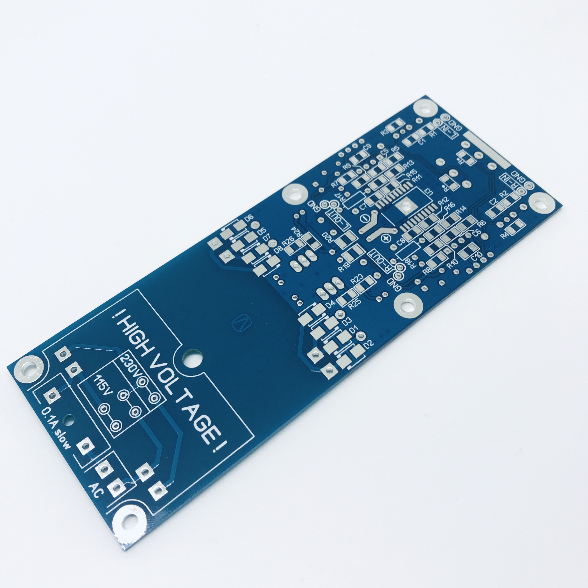

## Headphone amplifier THSADA

### Description
Headphone amplifier based on chip THS6012 and opamp ADA4627

### Links
- (in progress)

### Authors
- Shematic and PCB design - Vitaly Ovseitsev

### Buy parts for assembling
- [Order PCB from PCBWay](https://www.pcbway.com/project/shareproject/headphone_amp_thsada.html)

### Folder structure
Most folder names are self explanatory.
- 3d - contains 3d models of PCB
- bom - contains the bill of materials
- docs - contains drawings and images outputs of schematic and PCB files, assembling manuals
- firmware - contains compiled binary files
- gerbers - contains zip file of the PCB Gerbers and drill drawings for manufacture
- images - contain photo of assembling prototype
- pcb - contains the original schematic and PCB design files (Altium Designer,  KiCAD, SprintLayout, etc)
- soft - contains custom software using, for example, for operate with this device 
- source - contains project souce code (sketchs for Arduino, files C/C++, etc)
- transformers - contains spec for transformers, coils, etc